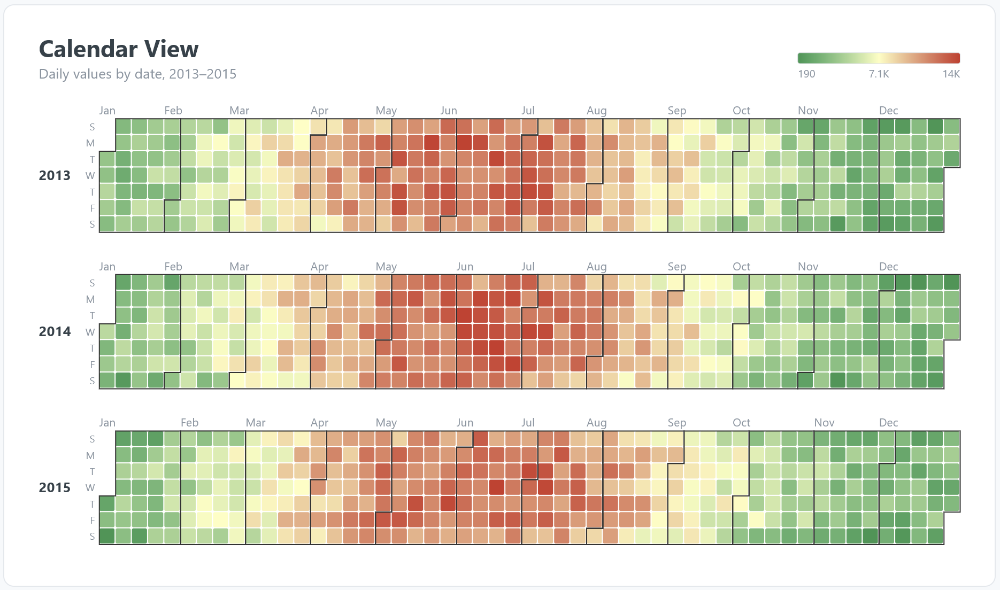

# Calendar Heatmap — SAC Custom Widget (v0.1.0)

A dense calendar heatmap for SAP Analytics Cloud. Plots a **measure** against a
**date** field, one cell per day, coloured on a configurable scale. Toggle between
a **horizontal** layout (weekday rows, week columns, one band per year — the
GitHub-contributions style) and a **vertical** layout (weekday columns, week rows
down the year, one column per year — the Vertex42 style). Same design language as
the Order Flow Funnel: configurable title/subtitle, self-contained SVG, no CDN.

## Files

| File | Purpose |
|------|---------|
| `calendarHeatmap.json` | Manifest — upload as the **JSON** in SAC. |
| `calendarHeatmap.zip` | JS bundle — upload as the **ZIP** in SAC. |
| `calendarHeatmap.js` | Main web component (self-contained SVG renderer). |
| `calendarHeatmapStyling.js` | Builder panel. |
| `renderer.core.js` | Canonical renderer, shared with the preview. |
| `preview.html` | Sandbox with three years of synthetic daily data + controls. |

## Data model

- **1 dimension = the date field**, at day granularity. The parser accepts the
  usual SAC member shapes (`YYYYMMDD`, `YYYY-MM-DD`, ISO timestamps, or a date-like
  label); unparseable members are skipped rather than breaking the render.
- **1 measure** = the value to colour by.

Every day in the covered year range is drawn; days with no value use `emptyColor`.

## Colour scale

A three-stop diverging scale (`colorLow` → `colorMid` → `colorHigh`). The domain is
either `auto` (data **min / median / max** — median as the mid anchor is robust to
outliers) or `manual` (`domainMin/Mid/Max`). `reverseScale` flips low/high without
re-picking colours. Default palette is Red-Yellow-Green with **high = red (hot)**,
matching the references; set `reverseScale` for high = green.

## Deploy (JSON + ZIP)

Same as the funnel: **Administration → App Integration → Custom Widgets → Add**,
upload `calendarHeatmap.json` (JSON slot) and `calendarHeatmap.zip` (ZIP slot),
then add the widget and bind the date dimension + measure. `supportsExport` is
`true`, so it's included in story PDF/PPT export.

## Key properties

| Property | Default | Notes |
|----------|---------|-------|
| `orientation` | horizontal | `horizontal` (year bands) or `vertical` (year columns). |
| `calendarType` | standard | `standard` (Gregorian) or `retail` (4-4-5 fiscal). |
| `retailPattern` | 4-4-5 | Retail quarter shape: `4-4-5`, `4-5-4`, or `5-4-4`. |
| `retailStartDate` | (blank) | Fiscal-year start, e.g. `2013-02-03`. Blank → auto (Jan 1 of first year). Snapped to the week-start day. |
| `weekStart` | sunday | `sunday` or `monday`. |
| `cellSize` | 15 | Day-cell size in px. |
| `colorLow` / `colorMid` / `colorHigh` | green / pale yellow / red | Diverging stops. |
| `reverseScale` | false | Flip low/high. |
| `scaleMode` | auto | `auto` (min/median/max) or `manual`. |
| `domainMin/Mid/Max` | 0/50/100 | Used when `scaleMode = manual`. |
| `emptyColor` | #EEF1F4 | Fill for in-range days with no data. |
| `showLegend` / `showMonthLabels` / `showWeekdayLabels` / `showYearLabels` | true | Toggles. |

## Retail (4-4-5) calendar

Set `calendarType = retail` to lay the year out as a retail fiscal calendar instead
of Gregorian months. A fiscal year is 12 periods grouped into 4 quarters of
**4-4-5** weeks (= 52 weeks); `retailPattern` also offers `4-5-4` and `5-4-4`.
`retailStartDate` sets the fiscal-year start (snapped to the week-start day); blank
auto-picks Jan 1 of the earliest year. Periods are named sequentially from the
start month (e.g. a February start → Feb, Mar, … Jan) and outlined as clean
whole-week blocks, since the grid is already week-indexed. Fiscal years are
labelled `FY<start-year>` (NRF convention).

**Limitation:** each fiscal year is a fixed 52 weeks. The periodic **53-week year**
(the NRF "restated" rule that reanchors the calendar every 5–6 years) is not yet
handled, so over long spans the fiscal start will drift ~1 day per year against a
fixed calendar anchor. Fine for a few years; ask if you need the 53-week reset.

## Design note

Both orientations are transposes of one grid model (a day maps to a week index and
a weekday column; the axes and the month-outline path just swap). That keeps the
geometry — including the stepped month outlines — in a single code path, which is
why it was quick to make robust. The horizontal layout is the continuous
GitHub-contributions style rather than the faceted month blocks in the first
reference; if you want the faceted look, that's a separate layout variant.

This is the **second reference widget** proving the scaffold generalises across very
different geometries. Both widgets share the same lifecycle plumbing, styling-panel
pattern, and build/QA loop — the basis for the reusable Skill.
