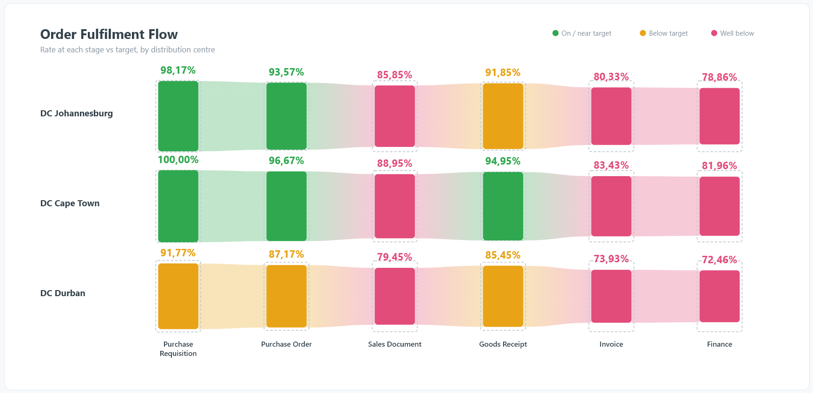

# Order Flow Funnel — SAC Custom Widget (v0.3.0)

A process-flow funnel for SAP Analytics Cloud. Each **measure** is a stage; the
bars are joined by tapering **flow ribbons**, sized by rate and coloured by
**variance to target** (green → amber → red). A dashed outline marks each target,
so shortfalls read at a glance. An optional **dimension trellises** the whole flow
— one panel per distribution centre, region, or channel. Self-contained SVG, no
CDN dependency.

## Files

| File | Purpose |
|------|---------|
| `orderFlowFunnel.json` | Manifest — upload as the **JSON** in SAC. |
| `orderFlowFunnel.zip` | JS bundle — upload as the **ZIP** in SAC. |
| `orderFlowFunnel.js` | Main web component (self-contained SVG renderer, no ECharts/CDN). |
| `orderFlowFunnelStyling.js` | Builder panel (title, targets, thresholds, colours). |
| `renderer.core.js` | Canonical renderer. Inlined into the main JS; loaded directly by `preview.html`. Single source of truth. |
| `preview.html` | Standalone sandbox — same renderer, editable stages, trellis demo toggle. |
| `icon.png` | Widget icon (already embedded in the manifest as a data URI). |

## Data model

**Measures are the stages.** Drop one measure per stage on the feed; feed order =
left-to-right order. Reorder the flow by reordering the measures. That is the whole
minimum setup.

**Targets** resolve per stage in this priority:
1. a *target measure* paired by name — any measure whose name contains `target` or
   `goal` is matched to the stage sharing its name stem
   (e.g. `DC Confirmation Qty Rate` ↔ `DC Confirmation Qty Rate Target`);
2. the `targets` property — a comma-separated list, one value per stage in order
   (e.g. `100,95,99,95,99,99`), the quickest option when targets aren't modelled
   as measures;
3. `defaultTarget`, as a fallback.

**Dimension = trellis (small multiples).** Add one dimension to repeat the flow
once per member. Panels stack vertically, share one stage axis along the bottom,
and are labelled by member in the left gutter. No dimension → one large flow.

**Value scaling.** `valueScale = auto` treats values ≤ 1.5 as fractions and ×100
(so `0.9817` → `98.17%`). Force with `percent` or `fraction`.

## Layout & export

The single-flow view renders at a **16:9** aspect with the flow band vertically
centred, so it sits cleanly in a report's hero section with room for detail below.
The trellis view grows taller as members are added (inherent to small multiples),
so size that tile accordingly. `supportsExport` is `true`, so the widget is
included when a story is exported to PDF/PPT — the render is synchronous inline
SVG, so nothing is fetched after load and the exporter never captures a blank frame.

## Deploy (JSON + ZIP)

SAC hosts the component files itself — no external web server needed.

1. In SAC: **⚙ (System) → Administration → App Integration**, enable custom widgets
   if required, then open **Custom Widgets → Add**.
2. Upload `orderFlowFunnel.json` in the **JSON** slot and `orderFlowFunnel.zip` in
   the **ZIP** slot.
3. In a story or Analytic Application, add the widget from **Custom Widgets**.
4. Bind your stage measures (and, to trellis, a dimension).

The manifest references the JS by relative path (`/orderFlowFunnel.js`,
`/orderFlowFunnelStyling.js`); those exact filenames sit at the root of the ZIP. If
you edit a JS file, re-zip it. `ignoreIntegrity` is `true` for now, so hash
mismatches won't block upload; to lock it down for production set it to `false` and
recompute (`openssl dgst -sha256 -binary FILE | openssl base64`).

## Properties

| Property | Default | Notes |
|----------|---------|-------|
| `width` / `height` | 1280 / 720 | Default tile size (16:9). |
| `title` / `subtitle` | "Order Fulfilment Flow" / "Rate at each stage vs target" | Header text. |
| `targets` | "" | Comma-separated targets, one per stage in order. |
| `defaultTarget` | 99 | Used when a stage has no paired target measure and no list entry. |
| `amberThreshold` | 2 | Points below target where green turns amber. |
| `redThreshold` | 10 | Points below target where amber turns red. |
| `goodColor` / `warnColor` / `badColor` | green / amber / pink | Traffic-light palette. |
| `valueScale` | auto | `auto` \| `percent` \| `fraction`. |
| `decimalSeparator` | `,` | `,` (ZA/EU) or `.`. |
| `showTargetGhost` | true | Dashed target outline behind each bar. |
| `showLegend` | true | Compact legend, top-right. |

## A note on the maths

Each bar is that stage's **own rate against its own target** — the ribbon is a
*visual* representation of the process sequence, not a cumulative survival curve.
The final retail-receipt rate is not the product of the earlier rates, which is why
a later bar can be taller than an earlier one. A strict cumulative funnel is a
different calculation and a small variant of this widget.

## Design note

This is one of two reference widgets (with the Calendar Heatmap) built on a shared
scaffold: the same lifecycle plumbing, the same config-driven styling-panel pattern,
and the same build/QA loop (concatenate renderer + wrapper, `node --check`, rasterise
and eyeball, mock the data binding to test parsing, compute SRI hashes, zip). The
renderer function is the only piece that changes per chart type — the basis for the
planned reusable `sac-custom-widget` skill.
